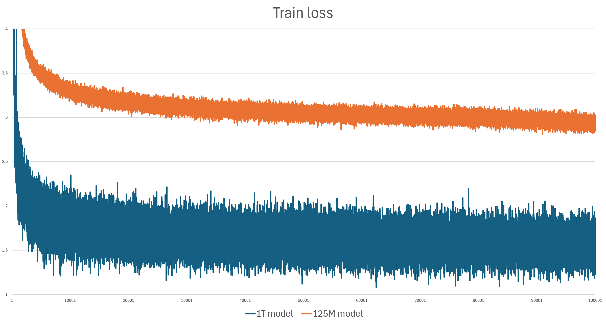

# Yes, you can train 1T model at home

Larger model allows for higher quality but comes at a cost. Normally train complexity grows linearly with the transformer parameter count. However we are not limited to spending model size on transformer parameters. Here we consider hybrid architectore, small transformer + rapid search over whole train set.

We compare two models  trained on 10B tokens from fineweb-EDU. First model is 125M non embedding parameters TScale transformer. Second model consists of two parts - same size transformer and full fineweb index for longest prefix search. Read more about [longest match search](lm_search.md). Fineweb-EDU contains ~100B tokens, index spends 8 bytes per token, so full index size is 800B or approximately 1T.

Transformer dimenstions are e512 h3 d50 (state width 512, 3 heads per layer, 50 layers). Models were trained for 100k batches, each batch 96x1024 token fragments.

Train loss graph:

Val set results:
|Model|LogLoss|Perplexity|Hellaswag|
|-----|-|------|--|
|125M |2.945|19.02|32.73%|
|125M + 1T index|0.825|2.28|36.02%|

Note that logloss reduction is much higher then hellaswag improvement. Most probably this happense due to numerous content duplication in fineweb dataset which is taken advantage of by this indexing approach. Validation log loss is much better then train loss since on average only half the dataset is looked up for train tokens. We search for longest prefix in history only, no lookup to the future tokens is performed.

# How to train 1T model with TScale

To train hybrid model you have to make two steps:
* Index train set with lm search enabled (USE_LMATCH=true).
* Train model over lm search enabled data source. Data source supports lm search if USE_LMATCH is set and directory with dataset index is specified with set_lmatch_index_folder().

Inferencing lm search index requires holding whole index in memory. For larger training set this requires plenty of RAM and might require distributed lm search setup.
