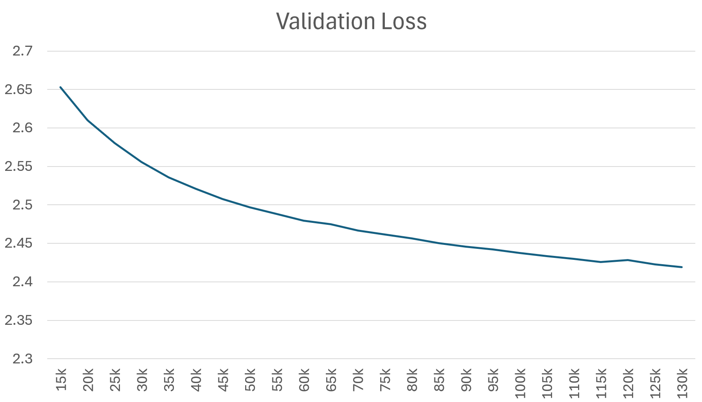
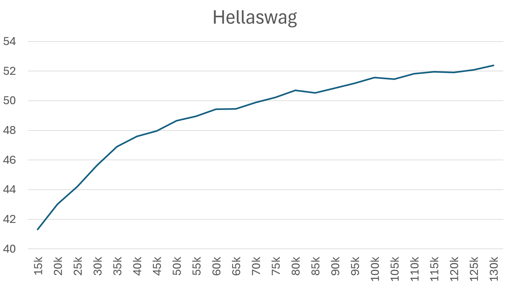
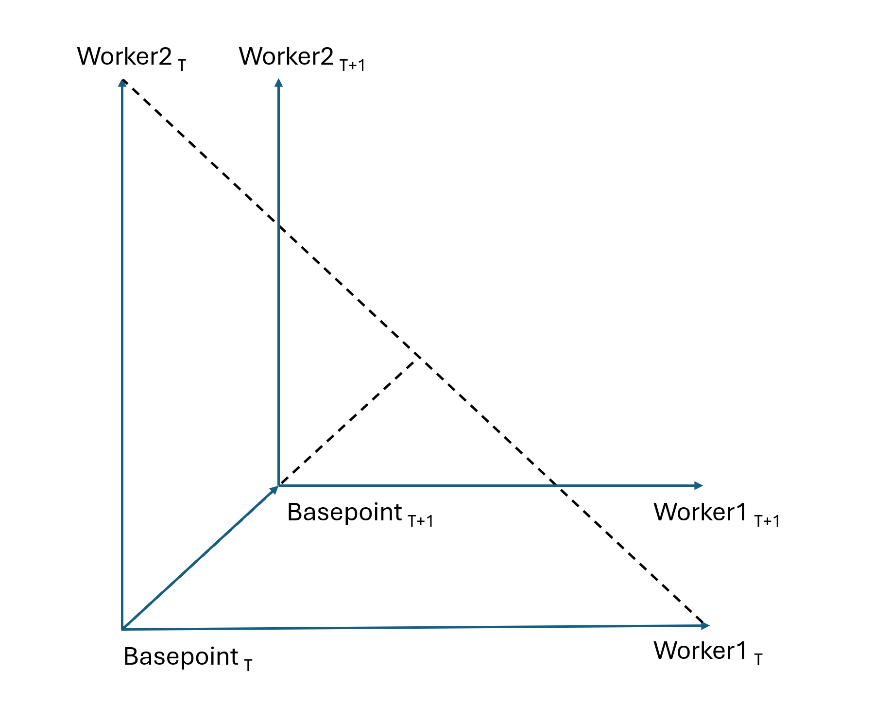

# Async Distributed Train

TScale async distributed training can train small and medium sized models with heterogeneous consumer grade hardware utilizing regular internet links as interconnect. Worker nodes can be unreliable, join and leave optimization process at arbitrary moments of time.

Scaling efficiency depends on training stage - at start adding more nodes does not speed up progress. As train progresses scaling becomes closer to linear.

Model quality is comparable with sync trading. Results for 1.5B model trained on fineweb with several hosts are below. Model dimensions are e1536 h12 d60 (state width 1536, 12 heads per layer, 60 layers). Model was trained for 130k batches, each batch 480x1024 token fragments. Validation loss and hellaswag scores are computed for average model over the last 5k batches at each point. Learning rate is constant after short warmup.




This run required about 2 days and used up to 5 hosts concurrently. All hosts had same 8x 4090 config however they had different performance due to unknonwn reasons (parallel load? TDP limit?). Different number of hosts along the run was caused by spot instances availability on runpod and vast. Batch size 480x 1024. Average rent cost of single host was ~$3.2 per hour,  average performance of single host was 800 batches/hour. Total GPU rent cost of this experiment ~$500.

# How it works
Distributed train consists of central host and workers. Central host tracks current "basepoint" model. All the workers connect to central host, receive new basepoint, compute model updates and send delta back to central host. Simplified outer iteration:
```
Each worker:
    StartK = WorkerK
    BatchCountK = 0
    for N seconds:
        WorkerK += grad(WorkerK) * learning_rate
        BatchCountK += 1
    DeltaK = WorkerK - StartK
    send DeltaK and BatchCountK to centeral host
Central host:
    Delta = weighted_avrg(DeltaK, BatchCountK)
    BatchCount = sum(BatchCountK)
    Basepoint += Delta * FedWeightScale
    for each worker:
        weightK = FedWeightScale * BatchCountK / BatchCount # for each worker
        send Basepoint, weightK # send new basepoint and worker weight to each worker
Each worker:
    WorkerK += new_basepoint - old_basepoint
    WorkerK -= weightK * deltaK # subtract this worker contribution to basepoint change
    WorkerMomentumK *= weightK # required for better convergence, slows down training
```
How each worker model WorkerK is update during each iteration:


To hide network exchange latency actual code performs all send receive operations and training concurrently. So DeltaK is taken from previous iteration. For this mode to converge FedWeightScale must be  no more then 0.5. For synchronous update FedWeightScale can be 1.

Actual model update on each worker adds not only current gradient but also momentum - moving average over previous gradients. For large models and large learning rates keeping momentum over basepoint update leads to slow convergence past some training point. To resolve this issue momentum is scaled on each worker after basepoint update. In a sense it is equivalent to updating momentum to new momentum estimate at new workerK model after basepoint update. Momentum for the current worker is taken as it is and for the other workers zero is taken as momentum estimate. Probably better momentum estimates are possible.

# How to run distributed train with TScale

Async training consists of [data server](code/gpt/data_server) providing training data, [central host](../code/gpt/fed_center) aggregating updates and multiple [workers](../code/gpt/fed_worker) performing computation. Data server is configured with [data script](data_script.md). Central host configuration consists of [training script commands](doc/train_script.md) with the few additional options. Fed worker parameters are specified in it's command line.

## fed_center script

Additional variable and commands for fed central host configuration:

* **DELTA_COLLECT_TIMEOUT = 1000**
Timeout in seconds to collect delta from all workers. Workers failed to send update within this interval will be disconnected

* **DELTA_COLLECT_MIN_INTERVAL = 200**
Set minimal iteration time. Applying global delta on workers consumes some time, during which GPU stay idle. Making iterations less frequent improves GPU utilization. Increasing this interval hurts scaling.

* **KEEP_MODEL_COUNT = 5**
On each iteration central host save current model on disk and erases obsolete models from disk . This variable controls how many models are kept on disk. The more models are kept the deeper rollback is possible at the expense of disk space.

* **SAVE_MODEL_INTERVAL = 5000**
Central host save average model each SAVE_MODEL_INTERVAL batches.

* **START_TRAIN_BATCH_COUNT = 50000**
Set current processed batch count. Useful if optimization is a continuation of training and starts from the model loaded with LoadModel().

* **run_fed_center('fed/models_folder')**
Run fed center, pass a folder to keep models and other data as an argument.

## fed_worker command line arguments

fed_worker is configured with a few command line options:

* **-c central_host_ip_adress**
Specify fed_center address
* **-n 16384**
Maximal tokens processed at once. Reduce this number to reduce VRam consumption. Must be greater or equal to model window size.
* **-d 4**
Set number of GPUs to use. Default is to use all GPUs.
* **-u worker_name**
Set worker name, this name will be displayed in fed_center statistics (availble at http://fed_center_ip:18181).

## fed_worker docker

Sample fed woker [dockerfile](../Dockerfile) is provided. Fed center ip address is expected at FED_CENTER env variable.
