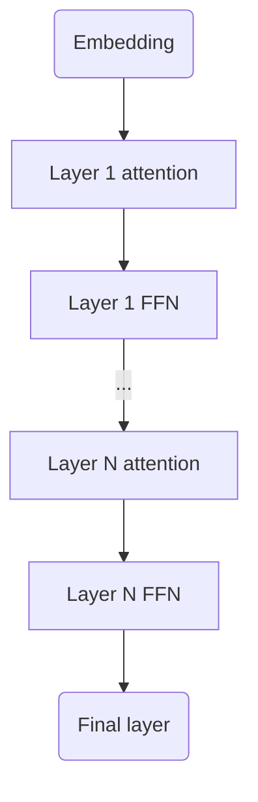
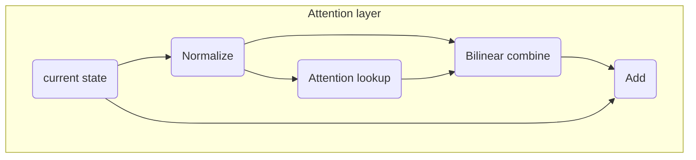
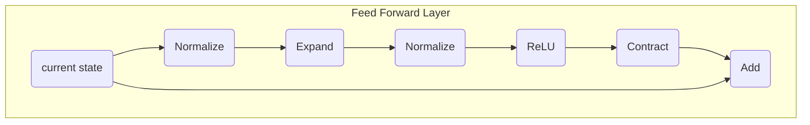

# TScale Transformer Model

TScale uses statndard tranformer model with interleaving attention and FFN layers with few tweaks.  Largest modification is the way attention lookup result is incorporated to the state.

## General structure

Let's look into this simplified transformer model. It consists of embedding, set of interleaving attention & FFN layers and final linear layer.



## Attention layer

TScale attention layer adds QKV vectors normalization to standard attention layer and uses bilinear operator to combine attention result to the state vector. This bilinear operator takes attention result and current state as inputs and outputs state delta where standard attention layer just applies linear transform to attention result and adds result to state vector. Schema:



Bilinear combine essentially performs this linear operation:
```python
state += torch.einsum('tx,ty,xyz->tz', attention_result, normalized_state, Combiner)
```
Implementing this literally would require cubic size Combiner tensor. To save memory it is approximated with set of block diagonal matrices reducing its size from $sn^2$ where s is state width and n is attention lookup vector size to $snK$ where K is size of block in block diagonal matrices. K is called COMBINER_REP in the code and equal to 4 which strikes good balance between combiner size and approximation quality.

## FFN layer

FFN layers utilize regular ReLU nonlinearity and perform vector normalization after applying first linear transform:



## Position encoding

For position encoding TScale transformer uses both alibi and RoPE. The idea is to reduce attention cost by reducing attention width as much as possible without compromising model quality too much. TScale uses attention widh 1 for the first 15% of layers effectively turning them into RNN since width 1 attention looks at previous token only. The rest layers are interleaved 
like this:

| Layer |Alibi slope|Width |
|-------|-----------|-----------------------------|
|2n     |0.5        | 64                          |
|2n + 1 |0          | full model width (like 2048)|

Using this reduced width attention cuts attention cost about x2, makes model training faster at least at the start.

## Initialization

All matrices are initialized with normally distributed random numbers except Combiner and Contract matrices which are zero-initialized.

## Quantization

By default code uses int8 for model tensors and state vectors. Gradients are packed to int8 in 128 parameter blocks to reduce PCIe traffic.

To experiemnt with stronger then int8 model parameters quantization see MPF_SIM_QUANT_2BIT. This flag rounds intf8 to 4 values before copying to GPU effectively simulating 2 bit model parameters precision.

## Optimizer

To optimize transformer model TScale uses custom optimizer. Unlike Adam second order statistics is collected for whole matrices by averaging second moment of every parameter. For final layer and embeddings statistics is aggregated by row collecting separate statistics for each token.

Momentum (beta) is increased over time. Smoothed gradient is mixed with non-smoothed one in 4:1 proportion (ie beta1 is set to 0 in terms of [AdEMAMix paper](https://arxiv.org/abs/2409.03137)).
